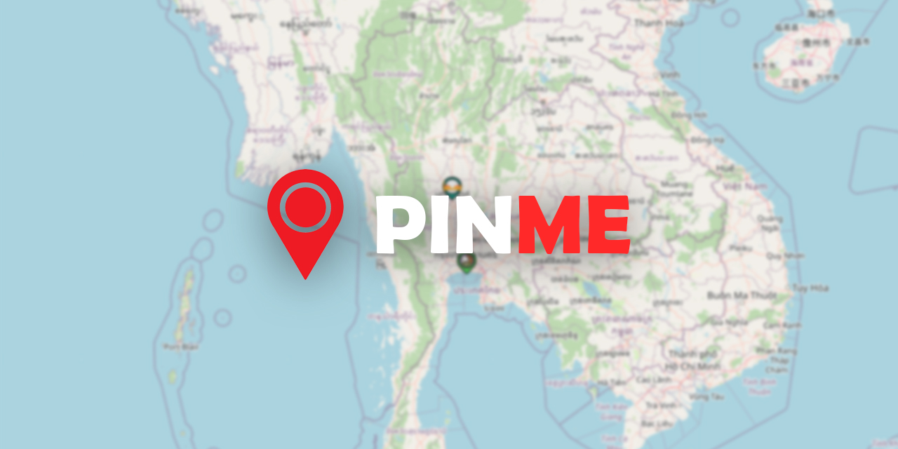

# :earth_asia: Pinme


**:black_nib: Description:**
This web map application uses a leaflet library to display the map and popups, and its goal is to enable users to save and share a favorite place they've visited.

**:black_nib: Related project:**
- [Leaflet](https://github.com/Leaflet/Leaflet) - JavaScript library for mobile-friendly interactive maps.
- [osrm-backend](https://github.com/Project-OSRM/osrm-backend) - High performance routing engine written in C++ designed to run on OpenStreetMap data.

**:black_nib: Requirements:**
- PHP 8.0+
- PDO driver for mysql
- MySQL

## :green_circle: Quick Start
**:black_nib: Installation**
1. Write your database information in lines 2 to 5 of api/connect_db_pdo.php in the api folder.
2. Enter your line notify token api at line 77 of api/line-notify-api.php.
3. Create a database with the same name as the one you entered in connect_db_pdo.php.
4. The table in the database you created will be constructed in the next step..
5. To manage all user accounts, you must first create an admin account by registering at http://yourdomain/admin_pwd_config.
6. You can verify that the username and password you registered are usable after creating an admin account by logging in at http://yourdomain/pwd.php.
7. You can delete the admin_pwd_config folder to stop unauthorized users from changing your admin account information
8. Try creating a user account in http://yourdomain/pwd.php and logging in in http://yourdomain/index.php to see if the user account table is usable.
9. Try pinning a location on the map, edit the pin, and then remove the pin, if everything goes smoothly, you complete the installation.

## :card_file_box: Features
### Pin on the map


### Sign in / Sign out Session


### Ensure that nobody takes your pin from the map.


### Notify in line app when someone share a new pin


### Navigator System


### Filtering pins


### Account Management


### The account with the ADMIN role has full access to the map's pin removal functionality


### Respondsive


## :spiral_notepad: OSRM Backend Recommendation
The main page will display a warning about the osrm demo server in the console. You can set up your own server using this tutorial
- [osrm-backend](https://github.com/Project-OSRM/osrm-backend)

By the way, because the osrm-backend does not support https by itself, we must use a reverse proxy, and this one is the example of reverse proxy on Apache2

```
<IfModule mod_ssl.c>
	<VirtualHost _default_:443>
		ServerAdmin webmaster@localhost
		DocumentRoot /var/www/html

		ErrorLog ${APACHE_LOG_DIR}/error.log
		CustomLog ${APACHE_LOG_DIR}/access.log combined

		SSLEngine on
		SSLCertificateFile	/etc/apache2/ssl/gimleng.pem
		SSLCertificateKeyFile /etc/apache2/ssl/gimleng.key

		<FilesMatch "\.(cgi|shtml|phtml|php)$">
				SSLOptions +StdEnvVars
		</FilesMatch>
		<Directory /usr/lib/cgi-bin>
				SSLOptions +StdEnvVars
		</Directory>
             
		Proxypass /route http://127.0.0.1:5000/route
		ProxypassReverse /route http://127.0.0.1:5000/route
	</VirtualHost>
</IfModule>
```

### As a result, OSRM-backend can completely function on https.

